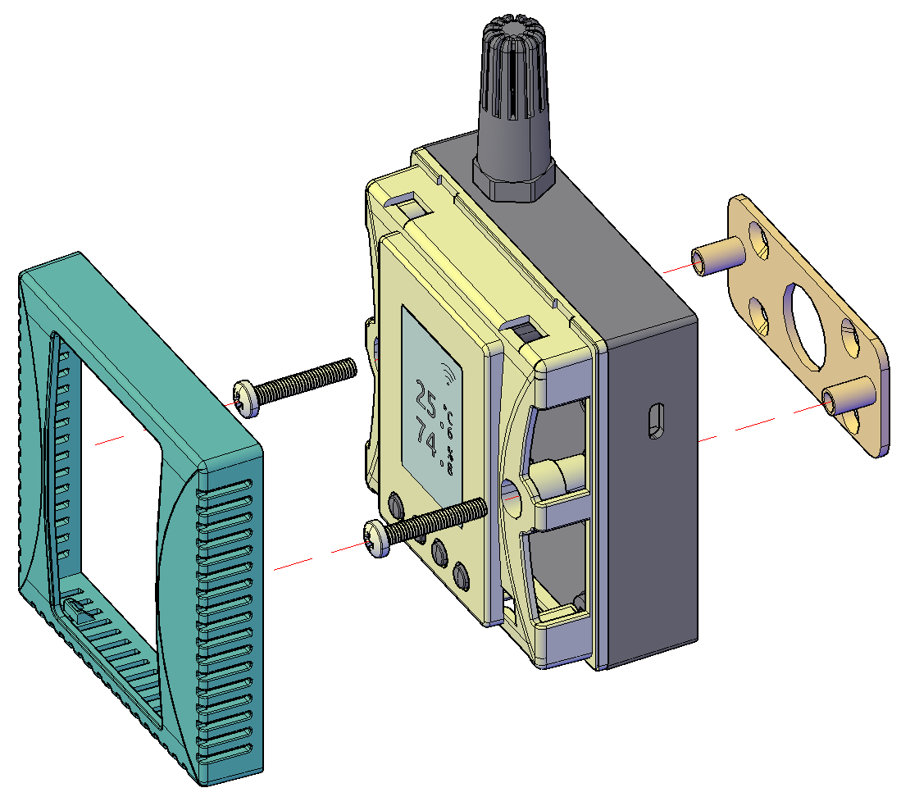

# 产品技术参数

## 测量范围和精度

- 温度测量范围：-25 ~ +65 ℃
- 温度典型精度：±0.2 °C (0 ~ 65 °C 区间), ±0.5 °C (全测量范围)
- 温度最大误差：±0.4 °C (0 ~ 65 °C 区间), ±0.8 °C (全测量范围)

--------------------

- 相对湿度测量范围：0 ~ 100 %RH
- 相对湿度典型精度：±2 %RH (10 ~ 90 %RH 区间), ±3 %RH (全测量范围)
- 相对湿度最大误差：±3.5 %RH (10 ~ 90 %RH 区间), ±5%RH (全测量范围)

## 设备电源

- 支持标准USB Type-C 5V供电。额定工作电流100mA，峰值工作电流小于200mA。
- 支持内部DC电源端子供电，额定输入电压DC12V，范围DC9~28V。

## WLAN 无线通讯

支持 IEEE 802.11 b/g/n 标准 2.4 GHz 频段 Wi-Fi 网络。

# 屏幕和按键说明

- 常规显示模式下，设备液晶屏上显示温度、湿度参数值。当配备不同的空气质量传感器，如CO₂、TVOC等，则会依次显示各项空气质量监测值。也可以按 ↓ 或 ↑ 按键切换显示内容。
- 按住 √ 按键1秒进入设备参数界面，可查看设备ip地址、设备时间、MAC地址、Wi-Fi网络、固件版本等参数信息。
- 同时按住中间的↓和↑按键5秒钟进入Wi-Fi配网界面，用手机或Pad扫描屏幕上显示的二维码进入Wi-Fi配网程序，设置设备运行时所要连接的Wi-Fi AP的SSID和密码信息。
- 同时按住两侧的 ⟲ 和 √ 按键5秒钟进入恢复出厂设置界面。设置恢复出厂设置并重启整个过程持续约十来秒。

  

  

  

  

# 安装说明

可通过安装背板支架并使用螺丝将设备固定在墙面或平面上。

扫描二维码查看详细使用说明

