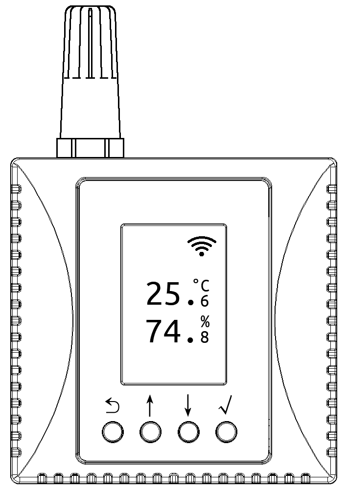
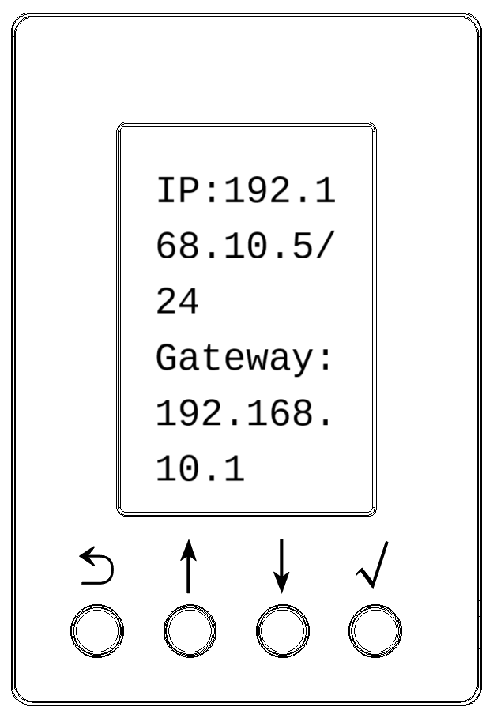
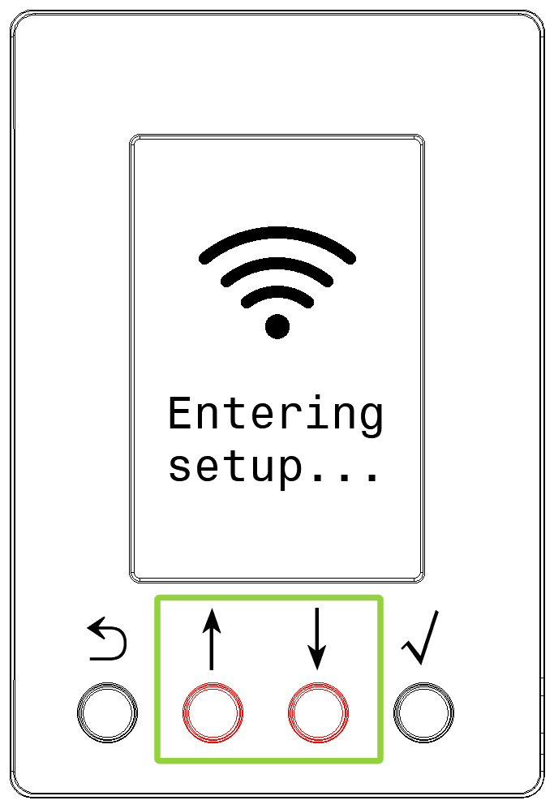
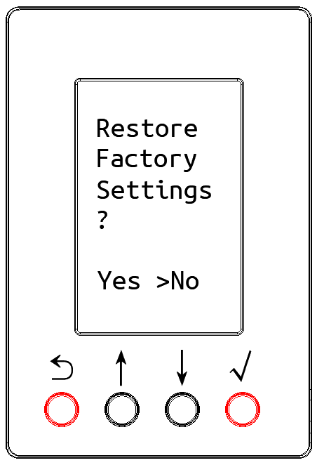
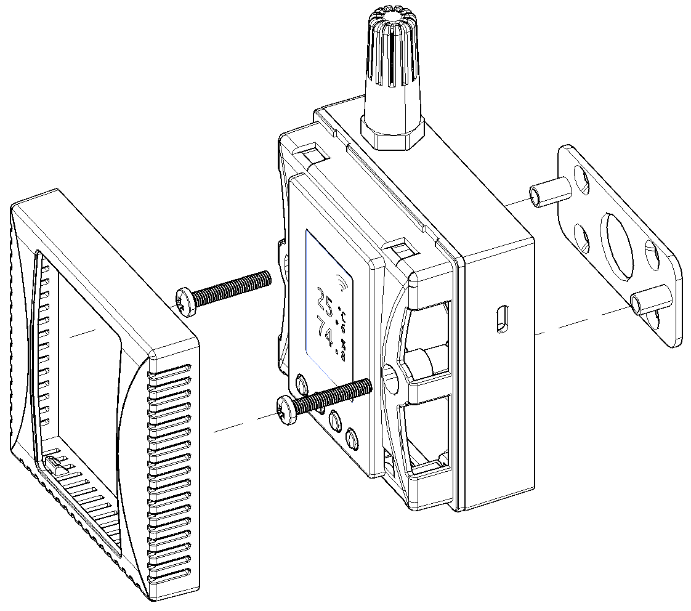

# Product Technical Specifications

## Measurement Range and Accuracy

<ul>
<li>Temperature Range: -25 ~ +65 ℃</li>
<li>Accuracy: ±0.4°C (0~65°C range), ±0.8°C (Full Range)</li>
</ul>

<ul>
<li>Relative Humidity Range: 0 ~ 100 %RH</li>
<li>Accuracy: ±3.5% (10~90% range), ±5% (Full Range)</li>
</ul>

## Power Supply

- Supports USB Type-C 5V input. Rated current: 100mA, Peak current: < 200mA.
- Supports internal DC power terminal supply, rated input voltage DC12V, range DC9~28V.

## WLAN Wireless Communication

Supports IEEE 802.11 b/g/n standard 2.4 GHz band Wi-Fi networks.

# Screen and Key Description

- In normal display mode, the device LCD shows temperature, humidity, and other parameter values.
- Press and hold the √ key for 1 second to enter the device parameter interface, where you can view device IP address, time, MAC address, Wi-Fi network, firmware version, etc.
- Press and hold the middle ↓ and ↑ keys simultaneously for 5 seconds to enter the Wi-Fi configuration interface. Scan the QR code on the screen with a phone or pad to enter the Wi-Fi configuration program.
- Press and hold the side ⟲ and √ keys simultaneously for 5 seconds to enter the factory reset interface. The factory reset and reboot process takes about ten seconds.

  

  

  

  

# Installation Instructions

The device can be fixed to a wall or flat surface using the backplate bracket and screws.

Scan the QR code to view detailed user instructions

