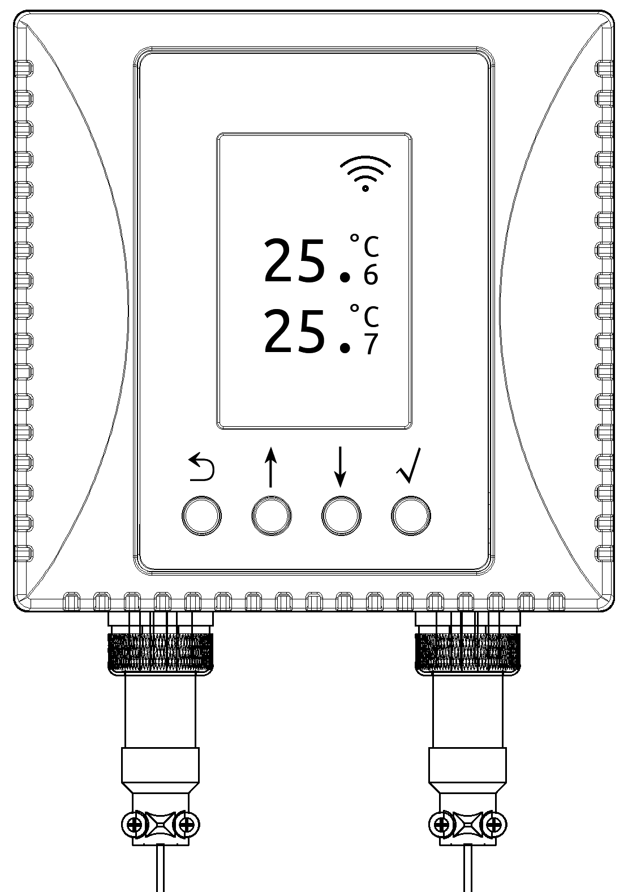
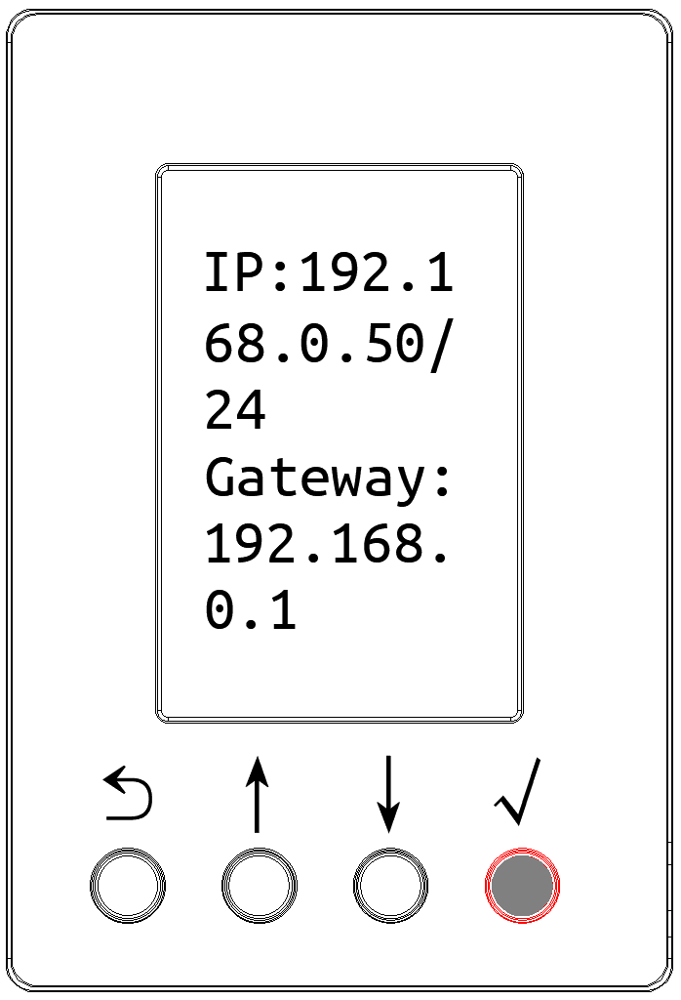
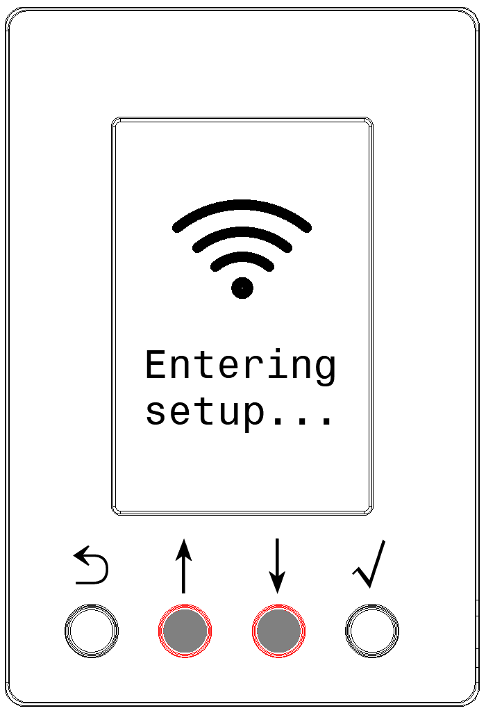
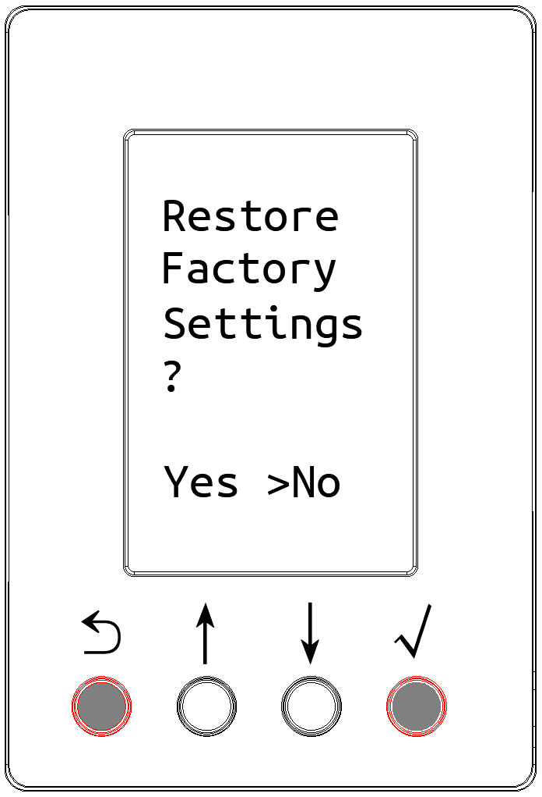
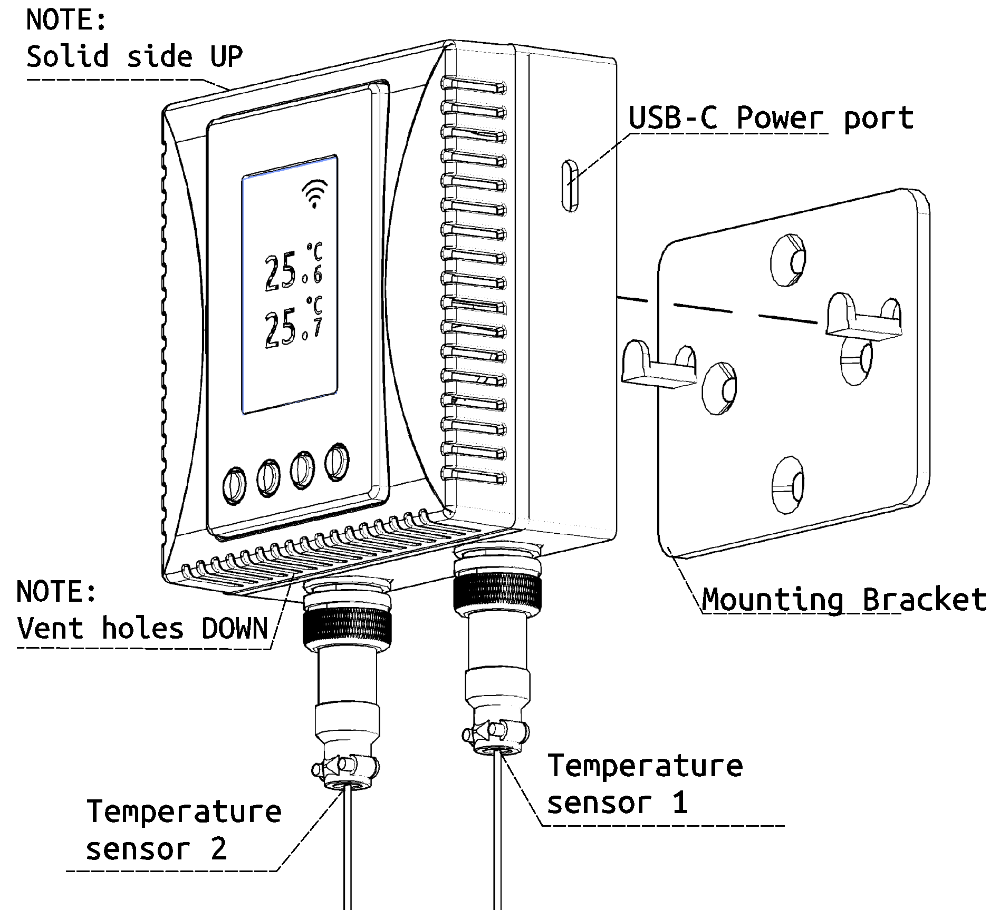
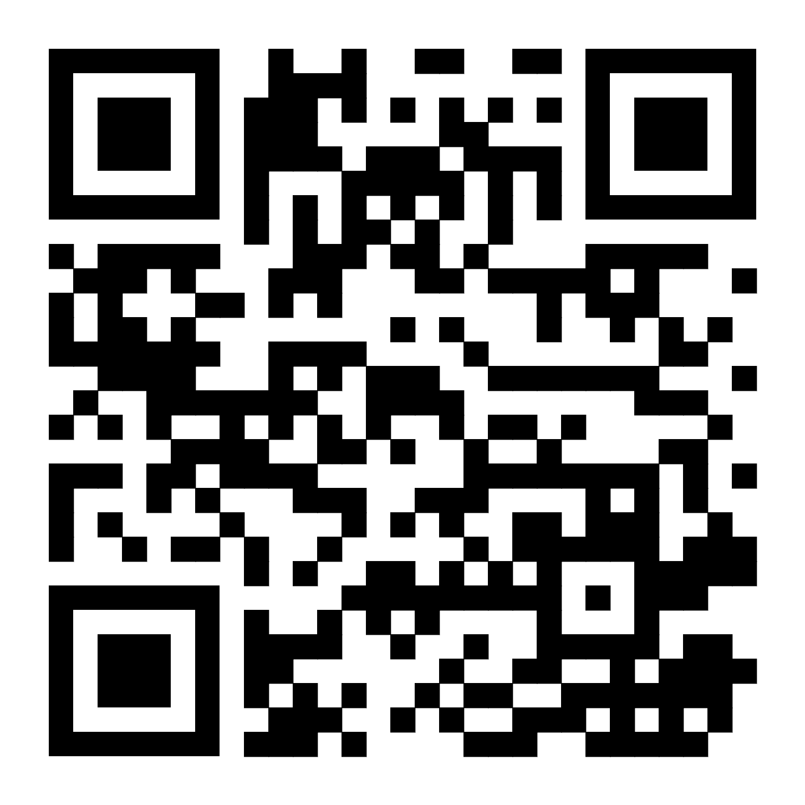

# Product Technical Specifications

## Measurement Range and Accuracy

<ul>
<li>Temperature Measurement Range: -40 ~ +85 ℃</li>
<li>Accuracy: ±0.5°C (-10~85°C range), ±1°C (Full Range)</li>
</ul>

## Power Supply

- Supports USB Type-C 5V input. Rated current: 100mA, Peak current: < 200mA.
- Supports internal DC power terminal supply, rated input voltage DC12V, range DC9~28V.

## WLAN Wireless Communication

Supports IEEE 802.11 b/g/n standard 2.4 GHz band Wi-Fi networks, Supports WPA-Personal/WPA-Enterprise.

# Screen and Key Description

- In normal display mode, the device LCD shows temperature readings from both sensors.
- Press and hold the √ key for 1 second to enter the device parameter interface, where you can view device IP address, time, MAC address, Wi-Fi network, firmware version, etc.
- Press and hold the middle ↓ and ↑ keys simultaneously for 5 seconds to enter the Wi-Fi configuration interface. Scan the QR code on the screen with a phone or pad to enter the Wi-Fi configuration program.
- Press and hold the side ⟲ and √ keys simultaneously for 5 seconds to enter the factory reset interface.

  

  

  

  

# Product Structure, Components & Mounting​

Scan the QR code to view detailed user instructions

