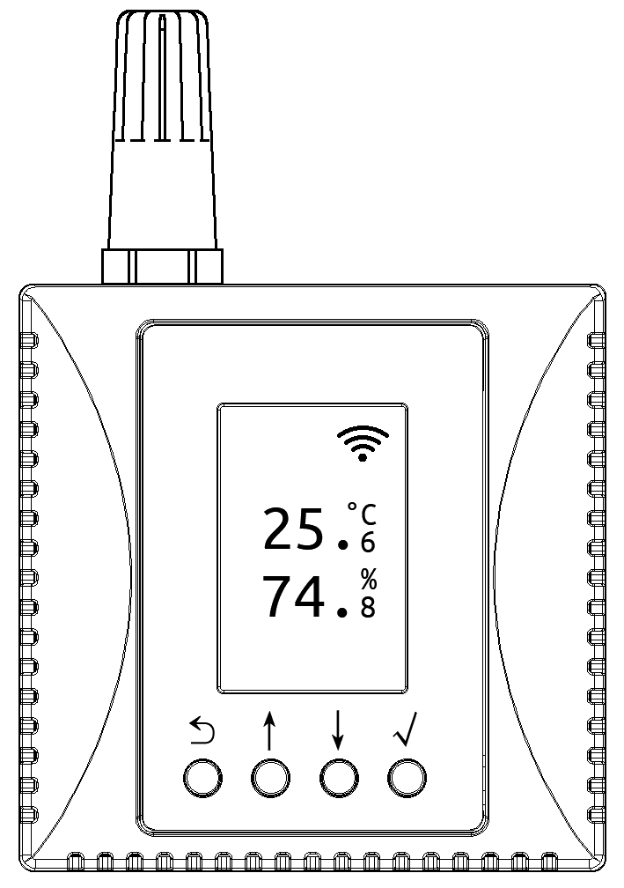
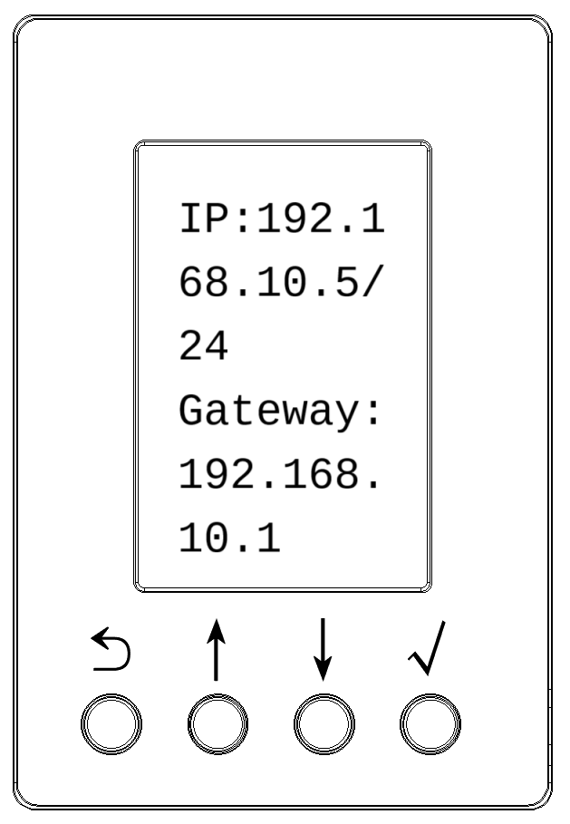
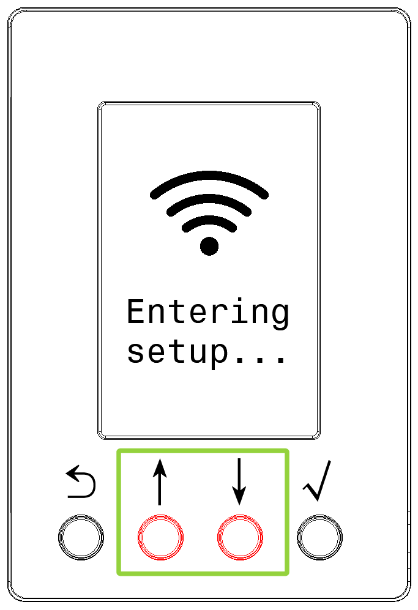
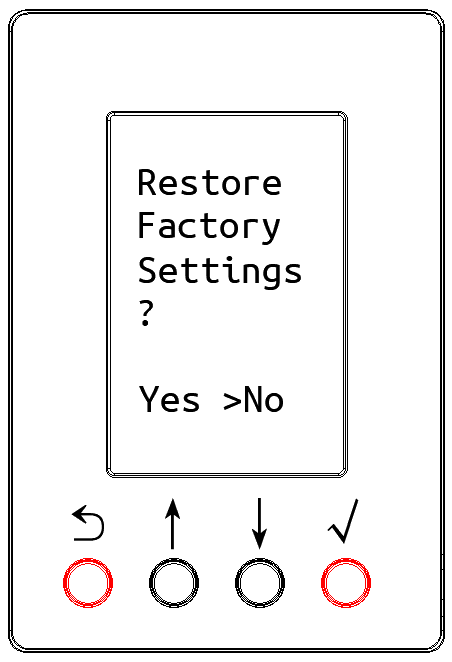
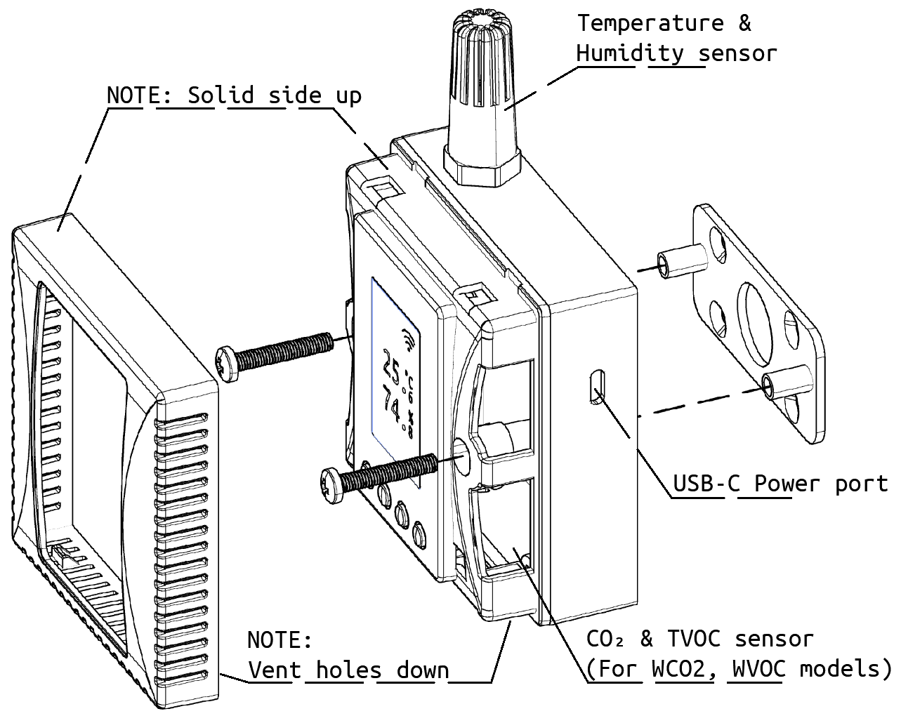

# Specifiche Tecniche del Prodotto

## Campo di Misura e Precisione

<ul>
<li>Campo di Temperatura: -25 ~ +65 ℃</li>
<li>Precisione: ±0,4°C (campo 0~65°C), ±0,8°C (campo completo)</li>
</ul>

<ul>
<li>Campo di Umidità Relativa: 0 ~ 100 %UR</li>
<li>Precisione: ±3,5% (campo 10~90%), ±5% (campo completo)</li>
</ul>

## Alimentazione Elettrica

- Supporta ingresso USB Type-C 5V. Corrente nominale: 100mA, Corrente di picco: < 200mA.
- Supporta alimentazione tramite terminale DC interno, tensione di ingresso nominale DC12V, campo DC9~28V.

## Comunicazione Wireless WLAN

Supporta reti Wi-Fi IEEE 802.11 b/g/n banda 2,4 GHz.

# Descrizione dello Schermo e dei Tasti

- In modalità di visualizzazione normale, il display LCD del dispositivo mostra la temperatura, l'umidità e altri valori dei parametri.
- Tenere premuto il tasto √ per 1 secondo per accedere all'interfaccia dei parametri del dispositivo, dove è possibile visualizzare l'indirizzo IP del dispositivo, l'ora, l'indirizzo MAC, la rete Wi-Fi, la versione del firmware, ecc.
- Tenere premuti contemporaneamente i tasti centrali ↓ e ↑ per 5 secondi per accedere all'interfaccia di configurazione Wi-Fi. Scansionare il codice QR sullo schermo con un telefono o un tablet per accedere al programma di configurazione Wi-Fi.
- Tenere premuti contemporaneamente i tasti laterali ⟲ e √ per 5 secondi per accedere all'interfaccia di ripristino fabbrica.

  

  

  

  

# Istruzioni di Installazione

Il dispositivo può essere fissato a una parete o superficie piana utilizzando la piastra di supporto posteriore e le viti.

Scansionare il codice QR per visualizzare le istruzioni dettagliate per l'utente

